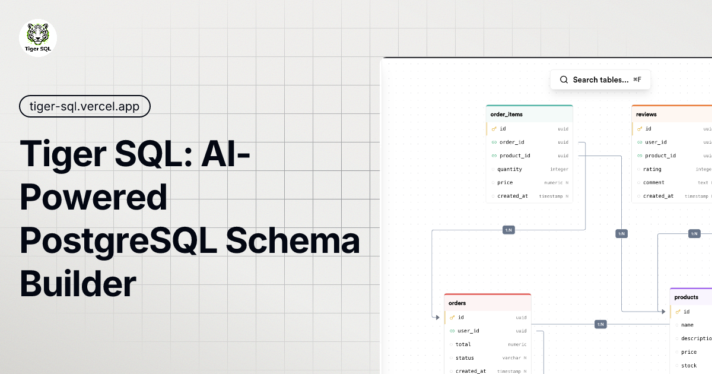

<!-- PROJECT LOGO -->
<br />
<div align="center">
  <a href="https://github.com/jacksonkasi1/tiger-sql">
    
  </a>

  <h1 align="center">Tiger SQL</h1>

  <p align="center">
    <strong>PostgreSQL Schema Visualizer & Designer with AI-Powered Assistance</strong>
    <br />
    Secure • Simple • Smart
    <br />
    <br />
    <a href="https://tiger-sql.vercel.app/"><strong>View Demo »</strong></a>
    <br />
    <br />
    <a href="https://github.com/jacksonkasi1/tiger-sql/issues">Report Bug</a>
    ·
    <a href="https://github.com/jacksonkasi1/tiger-sql/issues">Request Feature</a>
    ·
    <a href="https://github.com/jacksonkasi1/tiger-sql/discussions">Discussions</a>
  </p>

  <p align="center">
    <a href="https://github.com/sponsors/jacksonkasi1">
      
    </a>
    <a href="https://github.com/jacksonkasi1/tiger-sql/stargazers">
      
    </a>
    <a href="https://github.com/jacksonkasi1/tiger-sql/network/members">
      
    </a>
    <a href="https://github.com/jacksonkasi1/tiger-sql/blob/main/LICENSE.txt">
      
    </a>
  </p>
</div>



## 🎯 Overview

**Tiger SQL** is a powerful, modern PostgreSQL schema visualizer and designer that combines intuitive visual design with AI-powered assistance enhanced by the Model Context Protocol (MCP). Built with Next.js 15 and React 19, it offers a seamless experience for designing, visualizing, and managing database schemas without requiring any installations or sensitive credentials.

### 🔌 MCP Integration (Model Context Protocol)

Tiger SQL now features a **scalable, multi-server MCP architecture** that provides the AI assistant with up-to-date PostgreSQL knowledge and best practices:

- 🧠 **PostgreSQL Expertise** - Access to official PostgreSQL documentation via semantic search
- 📚 **Best Practices** - Curated PostgreSQL patterns and recommendations
- 🔄 **Always Up-to-Date** - Live knowledge from MCP servers (no outdated training data)
- 🎯 **Intelligent Routing** - Automatically decides when to use MCP based on request complexity
- 🔧 **Extensible** - Add your own MCP servers via configuration
- ⚡ **Production-Ready** - Built-in connection management, retry logic, and health checks

#### 🐘 Built-in: [pg-aiguide](https://github.com/timescale/pg-aiguide) by Timescale

Tiger SQL comes with **[pg-aiguide](https://github.com/timescale/pg-aiguide)** pre-integrated - an AI-optimized PostgreSQL knowledge base created by [Timescale](https://www.timescale.com/). This MCP server provides:

| Tool | Description |
|------|-------------|
| `pg_view_skill` | Get curated PostgreSQL best practices on specific topics |
| `pg_list_skills` | Browse all available PostgreSQL knowledge topics |
| `pg_semantic_search_postgres_docs` | Semantic search across official PostgreSQL documentation |

> **No setup required!** pg-aiguide works out of the box. The AI assistant automatically uses it when you ask about PostgreSQL best practices, optimization, or schema design patterns.

**User Controls:**
Users can control MCP behavior with special commands:
- `[use-mcp]` - Force MCP usage for this request
- `[skip-mcp]` - Skip MCP, use direct execution
- `[mcp-verbose]` - Show detailed MCP queries
- `[use-server:server-id]` - Use specific MCP server only
- `[exclude-server:server-id]` - Exclude specific server

Learn more about MCP: [Vercel AI SDK MCP Documentation](https://ai-sdk.dev/docs/ai-sdk-core/mcp-tools)

## ✨ Features

### 🎨 **Visual Schema Designer**
- 🖱️ **Drag & Drop Interface** - Create and connect tables effortlessly
- 🔄 **Undo/Redo Support** - Full history management with keyboard shortcuts (Cmd/Ctrl+Z)
- 🎯 **Smart Auto-Layout** - Automatic table arrangement using Dagre algorithm
- 🌈 **Random Table Colors** - Beautiful, randomized color schemes for tables
- 📸 **Export to Image** - Save your schema as PNG
- 🔍 **Zoom & Pan** - Smooth navigation with minimap support

### 🤖 **AI-Powered Assistant (Enhanced with MCP)**
- 💬 **Interactive Chat** - AI assistant to help with schema design
- 🧠 **Smart Suggestions** - Get recommendations powered by PostgreSQL best practices via MCP
- 📝 **Context-Aware** - Understands your current schema state and uses up-to-date PostgreSQL knowledge
- 🚀 **Powered by Multiple LLMs** - Support for OpenAI and Google AI
- 🔌 **MCP Integration** - Access to real-time PostgreSQL documentation and expertise
- 📚 **Best Practices** - Automatic guidance from curated PostgreSQL patterns

### 🔐 **Connection Modes**

Create relationships between tables by dragging from one column to another. Choose between two validation modes:

#### 🔓 **Flexible Mode** (Unlock Icon)
- Connect **any column to any column** without type restrictions
- Perfect for quick prototyping and sketching
- Ideal for custom types or extensions
- Maximum flexibility in schema design

#### 🔐 **Strict Mode** (Lock Icon)
- Only allows connections between **type-compatible columns**
- Validates PostgreSQL data type compatibility
- Prevents invalid relationships
- Production-ready schema design

##### Type Compatibility Groups

| Category | Compatible Types |
|----------|------------------|
| **UUID** | `uuid` |
| **Integer** | `integer`, `int`, `int2`, `int4`, `int8`, `smallint`, `bigint`, `serial`, `smallserial`, `bigserial` |
| **Numeric** | `numeric`, `decimal` |
| **Float** | `real`, `float4`, `double precision`, `float8` |
| **String** | `text`, `varchar`, `char`, `character`, `character varying` |
| **Boolean** | `boolean`, `bool` |
| **Date** | `date` |
| **Time** | `time`, `timetz` |
| **Timestamp** | `timestamp`, `timestamptz` |
| **JSON** | `json`, `jsonb` |
| **Binary** | `bytea` |

### 💾 **Data Management**
- 📦 **Import SQL** - Load existing schemas from SQL files
- 💿 **Export SQL** - Generate SQL DDL for your schema
- 🔄 **LocalStorage Persistence** - Your work is automatically saved
- 🚪 **No Login Required** - Start designing immediately

### 🛡️ **Security & Privacy**
- 🔒 **Client-Side Only** - All processing happens in your browser
- 👀 **No Sensitive Data** - Only uses public API keys
- 🔐 **No Database Passwords** - Secure by design
- 🚫 **No Server Storage** - Your data stays on your device

### 🎮 **User Experience**
- ⚡ **Lightning Fast** - Built with modern React and Next.js
- 🎨 **Beautiful UI** - Powered by Tailwind CSS and shadcn/ui
- 📱 **Responsive Design** - Works on all screen sizes
- ⌨️ **Keyboard Shortcuts** - Power-user friendly
- 🌙 **Dark Mode Support** - Easy on the eyes

## 🚀 Getting Started

### Online (Recommended)

Simply visit [Tiger SQL](https://tiger-sql.vercel.app/) and start designing your schema immediately!

### With Supabase

1. Go to [Supabase Dashboard](https://app.supabase.io/)
2. Select your Project
3. Navigate to `Settings` → `API`
4. Copy your `URL` and `anon/public` key
5. Paste them into Tiger SQL
6. Click "Fetch Schema"
7. Start visualizing! 🎉

### Import Existing Schema

1. Click "Import SQL" button
2. Paste your SQL DDL or drag & drop a `.sql` file
3. Watch your schema come to life!

## 🛠️ Built With

Tiger SQL is built with modern, cutting-edge technologies:

- **[Next.js 15](https://nextjs.org/)** - React framework for production
- **[React 19](https://react.dev/)** - Latest React with concurrent features
- **[TypeScript](https://www.typescriptlang.org/)** - Type safety and better DX
- **[Tailwind CSS](https://tailwindcss.com/)** - Utility-first CSS framework
- **[shadcn/ui](https://ui.shadcn.com/)** - Beautiful, accessible components
- **[XYFlow/React Flow](https://reactflow.dev/)** - Powerful flow diagram library
- **[Zustand](https://zustand-demo.pmnd.rs/)** - Lightweight state management
- **[AI SDK](https://sdk.vercel.ai/)** - AI integration by Vercel
- **[Zod](https://zod.dev/)** - TypeScript-first schema validation

## 💻 Local Development

### Prerequisites

- **[Bun](https://bun.sh/)** runtime (v1.0+)

### Installation

1. **Clone the repository**
   ```bash
   git clone https://github.com/jacksonkasi1/tiger-sql.git
   cd tiger-sql
   ```

2. **Install dependencies**
   ```bash
   bun install
   ```

3. **Set up environment variables** (Optional - for AI features)
   ```bash
   cp .env.example .env.local
   ```
   
   Add your API keys:
   ```env
   OPENAI_API_KEY=your_openai_key_here
   GOOGLE_GENERATIVE_AI_API_KEY=your_google_ai_key_here
   ```

4. **Configure MCP Servers** (Optional - for custom MCP servers)
   ```bash
   cp .mcp-config.example.json .mcp-config.json
   ```
   
   The built-in pg-aiguide MCP server works out of the box. Add custom servers in `.mcp-config.json`:
   ```json
   {
     "version": "1.0.0",
     "servers": [
       {
         "id": "my-custom-mcp",
         "name": "My Custom MCP Server",
         "transport": {
           "type": "http",
           "url": "https://mcp.example.com"
         },
         "enabled": true,
         "priority": 50,
         "tags": ["custom"],
         "toolNamespace": "custom_"
       }
     ]
   }
   ```

5. **Run the development server**
   ```bash
   bun dev
   ```

6. **Open your browser**
   
   Navigate to [http://localhost:3000](http://localhost:3000)

### Available Scripts

- `bun dev` - Start development server
- `bun run build` - Build for production
- `bun start` - Start production server
- `bun run lint` - Run ESLint
- `bun run typecheck` - Run TypeScript type checking
- `bun run analyze` - Analyze bundle size
- `bun run test:memory` - Run memory leak tests

## 🔌 MCP Architecture

Tiger SQL features a **scalable, configuration-driven MCP architecture** designed for production use:

### Key Features

- **Multi-Server Support** - Connect to multiple MCP servers simultaneously
- **Configuration-Driven** - Add/remove servers via JSON config files
- **Intelligent Routing** - Automatic tool selection based on request complexity
- **Connection Management** - Built-in retry logic, timeouts, and health checks
- **Tool Namespacing** - Avoid conflicts with prefixed tool names (e.g., `pg_`, `custom_`)
- **Lifecycle Hooks** - Monitor connections and tool usage
- **Graceful Degradation** - App works even if MCP servers are unavailable

### Adding Custom MCP Servers

1. **Via Configuration File** (Recommended)
   
   Create `.mcp-config.json` in the project root:
   ```json
   {
     "version": "1.0.0",
     "servers": [
       {
         "id": "my-mcp",
         "name": "My Custom MCP",
         "transport": {
           "type": "http",
           "url": "https://mcp.example.com"
         },
         "enabled": true,
         "priority": 50,
         "tags": ["custom"],
         "toolNamespace": "custom_"
       }
     ]
   }
   ```

2. **Via Code** (For Built-in Servers)
   
   Edit `src/lib/mcp/config.ts` and add to `BUILTIN_MCP_SERVERS`:
   ```typescript
   {
     id: 'my-builtin-mcp',
     name: 'My Built-in MCP',
     transport: {
       type: 'http',
       url: 'https://mcp.example.com',
     },
     enabled: true,
     priority: 50,
     tags: ['builtin'],
     toolNamespace: 'builtin_',
   }
   ```

3. **Environment Variables**
   
   Override defaults:
   ```env
   MCP_CONFIG_PATH=./custom-mcp-config.json
   MCP_DISABLE_BUILTIN=false
   MCP_AUTO_CONNECT=true
   MCP_TIMEOUT=10000
   MCP_RETRY_ATTEMPTS=2
   ```

### MCP Transport Types

- **HTTP** (Recommended for production) - RESTful API endpoint
- **SSE** - Server-Sent Events for streaming
- **Stdio** - Local servers via stdin/stdout (development only)

### Learn More

- [MCP Architecture Documentation](docs/MCP_INTEGRATION_PLAN.md)
- [MCP Usage Guide](docs/MCP_USAGE_GUIDE.md)
- [MCP Quick Start](MCP_QUICKSTART.md)
- [Vercel AI SDK MCP Guide](https://ai-sdk.dev/docs/ai-sdk-core/mcp-tools)
- [pg-aiguide GitHub](https://github.com/timescale/pg-aiguide) - Built-in PostgreSQL knowledge by Timescale

## 🤝 Contributing

Contributions make the open-source community an amazing place to learn, inspire, and create. Any contributions you make are **greatly appreciated**!

### How to Contribute

1. **Fork the Project**
2. **Create your Feature Branch**
   ```bash
   git checkout -b feature/AmazingFeature
   ```
3. **Commit your Changes**
   ```bash
   git commit -m 'feat: Add some AmazingFeature'
   ```
4. **Push to the Branch**
   ```bash
   git push origin feature/AmazingFeature
   ```
5. **Open a Pull Request**

### Commit Convention

We follow [Conventional Commits](https://www.conventionalcommits.org/):

- `feat:` - New features
- `fix:` - Bug fixes
- `docs:` - Documentation changes
- `style:` - Code style changes (formatting, etc.)
- `refactor:` - Code refactoring
- `test:` - Adding or updating tests
- `chore:` - Maintenance tasks

## 🗺️ Roadmap

- [x] MCP Integration - Multi-server architecture for PostgreSQL knowledge
- [ ] Additional MCP Servers (pgvector, PostGIS, Supabase)
- [ ] Multi-schema support
- [ ] Multi-project support connected to GitHub repository
- [ ] Collaborative editing
- [ ] Schema versioning
- [ ] More export formats (JSON, YAML)
- [ ] Database connection for live schema sync
- [ ] Template library
- [ ] Advanced AI features (query generation, optimization)
- [ ] MCP Server UI management (enable/disable servers from UI)

See the [open issues](https://github.com/jacksonkasi1/tiger-sql/issues) for a full list of proposed features and known issues.

## 📊 Performance

Tiger SQL is optimized for performance with:

- ⚡ Virtual scrolling for large schemas
- 🧠 Efficient state management with Zustand
- 🔄 Optimized re-renders with React 19
- 💾 Smart caching strategies
- 📦 Code splitting and lazy loading
- 🎯 Memory leak prevention (tested with MemLab)

## 🙏 Acknowledgements

Special thanks to:

- [Supabase](https://supabase.io/) - For the inspiration and type generation approach
- [React Flow](https://reactflow.dev/) - Excellent flow diagram library
- [shadcn/ui](https://ui.shadcn.com/) - Beautiful component library
- [Vercel](https://vercel.com/) - Hosting and deployment
- All contributors who have helped improve Tiger SQL

## 💖 Support the Project

If you find Tiger SQL helpful, consider supporting its development:

<div align="center">
  <a href="https://github.com/sponsors/jacksonkasi1">
    
  </a>
</div>

Your support helps maintain and improve Tiger SQL for everyone! ⭐

## 📜 License

Distributed under the MIT License. See [`LICENSE.txt`](LICENSE.txt) for more information.

**Not associated with Supabase.**

## 📧 Contact

**Jackson Kasi** - [@jacksonkasi0](https://twitter.com/jacksonkasi0)

**Project Link:** [https://github.com/jacksonkasi1/tiger-sql](https://github.com/jacksonkasi1/tiger-sql)

---

<div align="center">
  <p>Made with ❤️ by <a href="https://github.com/jacksonkasi1">Jackson Kasi</a></p>
  <p>
    <a href="https://github.com/jacksonkasi1/tiger-sql/stargazers">⭐ Star this repo</a>
    if you find it useful!
  </p>
</div>