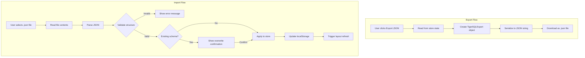

# Tiger SQL - Lossless JSON Export/Import Plan

## Problem Statement

The current SQL export and schema import functionality does not preserve the schema accurately:
- Exported SQL does not fully match the original schema structure when re-imported
- This causes data loss, mismatches, or structural drift
- SQL parsing is lossy by nature - it cannot capture all internal state

## Solution Overview

Implement a **JSON-based export/import** system that:
1. Exports the schema **exactly as stored internally** in localStorage
2. Uses the **same JSON structure** that the application uses
3. Creates a **portable JSON snapshot** of the complete schema state
4. On import, **reconstructs the schema 1:1** without transformation or loss

## Current Internal Schema Structure

Based on analysis of [`src/lib/store.ts`](src/lib/store.ts) and [`src/lib/types.ts`](src/lib/types.ts), the schema state consists of:

### Core Data Structures

```typescript
// Tables - the main schema data
interface TableState {
  [key: string]: Table;
}

interface Table {
  title: string;
  columns?: Column[];
  position?: Position;      // { x: number, y: number }
  is_view?: boolean;
  schema?: string;          // Schema name (e.g., 'public', 'auth')
  color?: string;           // Header color for the table card
  comment?: string;         // Comment/note for the table
  constraints?: TableConstraint[];
  indexes?: TableIndex[];
}

interface Column {
  title: string;
  format: string;           // Raw SQL type string
  type: string;
  baseType?: string;
  modifiers?: ColumnModifiers;
  default?: any;
  required?: boolean;
  pk?: boolean;
  fk?: string | undefined;
  unique?: boolean;
  enumValues?: string[];
  enumTypeName?: string;
  isArray?: boolean;
  comment?: string;
}

// Enum Types - stored separately
interface EnumTypeDefinition {
  name: string;
  schema?: string;
  values: string[];
}

// Edge Relationships - relationship types between tables
type RelationshipType = 'one-to-one' | 'one-to-many' | 'many-to-one' | 'many-to-many';
```

### localStorage Keys Used

From [`src/lib/store.ts`](src/lib/store.ts:431-436):
- `table-list` - Main table definitions (TableState)
- `edge-relationships` - Relationship types between tables
- `visible-schemas` - Which schemas are visible
- `collapsed-schemas` - Which schemas are collapsed
- `enum-types` - Enum type definitions
- `connection-mode` - 'strict' or 'flexible'

## JSON Export Format

The exported JSON file will contain all schema-related state:

```typescript
interface TigerSQLExport {
  version: string;              // Export format version for future compatibility
  exportedAt: string;           // ISO timestamp
  schema: {
    tables: TableState;         // Complete table definitions
    enumTypes: Record<string, EnumTypeDefinition>;
    edgeRelationships: Record<string, RelationshipType>;
    visibleSchemas: string[];   // Array of visible schema names
    collapsedSchemas: string[]; // Array of collapsed schema names
  };
  metadata?: {
    tableCount: number;
    enumCount: number;
    exportSource: string;       // 'tiger-sql'
  };
}
```

## Implementation Plan

### 1. Create JSON Export Utility

**File:** [`src/lib/json-schema-io.ts`](src/lib/json-schema-io.ts) (new file)

```typescript
// Export function
export function exportSchemaToJSON(
  tables: TableState,
  enumTypes: Record<string, EnumTypeDefinition>,
  edgeRelationships: Record<string, RelationshipType>,
  visibleSchemas: Set<string>,
  collapsedSchemas: Set<string>
): TigerSQLExport

// Download helper
export function downloadSchemaJSON(
  exportData: TigerSQLExport,
  filename?: string
): void
```

### 2. Create JSON Import Utility

**File:** [`src/lib/json-schema-io.ts`](src/lib/json-schema-io.ts)

```typescript
// Validation result
interface ImportValidationResult {
  valid: boolean;
  errors: string[];
  warnings: string[];
  data?: TigerSQLExport;
}

// Import function
export function validateSchemaJSON(json: string): ImportValidationResult

// Apply import to store
export function applySchemaImport(
  data: TigerSQLExport,
  store: AppState
): void
```

### 3. Update UI Components

#### Helper.tsx - Add Export JSON Button

Add a new button next to the existing "Export SQL" button:

```tsx
<Button
  variant="outline"
  size="icon"
  title="Export JSON Schema"
  onClick={handleExportJSON}
>
  <FileJson size={20} />
</Button>
```

#### ImportSQL.tsx - Support JSON Files

Modify the import dialog to:
1. Accept both `.sql` and `.json` files
2. Detect file type by extension
3. Use appropriate parser based on file type
4. Show different UI feedback for JSON imports

### 4. Validation Rules

The import validation should check:

1. **Structure validation:**
   - Required fields present (`version`, `schema`, `schema.tables`)
   - Correct data types for all fields

2. **Data integrity:**
   - Table names are valid strings
   - Column definitions have required fields
   - Foreign key references point to valid tables
   - Enum type references are valid

3. **Version compatibility:**
   - Check export version against current app version
   - Warn if importing from newer version

## File Changes Summary

| File | Change Type | Description |
|------|-------------|-------------|
| `src/lib/json-schema-io.ts` | New | JSON export/import utilities |
| `src/lib/types.ts` | Modify | Add TigerSQLExport interface |
| `src/components/Helper.tsx` | Modify | Add Export JSON button |
| `src/components/ImportSQL.tsx` | Modify | Support JSON file import |

## UI Design

### Export JSON Button
- Location: Helper toolbar, next to "Export SQL" button
- Icon: `FileJson` from lucide-react
- Tooltip: "Export JSON Schema"
- Behavior: Downloads `schema_YYYY-MM-DD.json`

### Import Dialog Changes
- Accept: `.sql, .json` files
- Auto-detect file type
- Show "JSON Import" or "SQL Import" label based on file type
- For JSON: Show validation results before import
- Success message: "Imported X tables from JSON"

## Data Flow Diagram



## Testing Strategy

1. **Unit Tests:**
   - Export produces valid JSON
   - Import validates correctly
   - Round-trip preserves all data

2. **Integration Tests:**
   - Export from UI works
   - Import from UI works
   - Overwrite confirmation works

3. **Manual Testing:**
   - Export complex schema with multiple schemas, enums, relationships
   - Import into fresh browser
   - Verify all data matches exactly

## Migration Notes

- Existing SQL export/import remains unchanged
- JSON export/import is additive functionality
- No breaking changes to existing features
- Users can choose between SQL (human-readable) and JSON (lossless)

## Success Criteria

1. ✅ Export creates valid JSON file
2. ✅ Import restores schema exactly as exported
3. ✅ All table properties preserved (position, color, comments, etc.)
4. ✅ All enum types preserved
5. ✅ All edge relationships preserved
6. ✅ Schema visibility settings preserved
7. ✅ No data loss or transformation during round-trip
